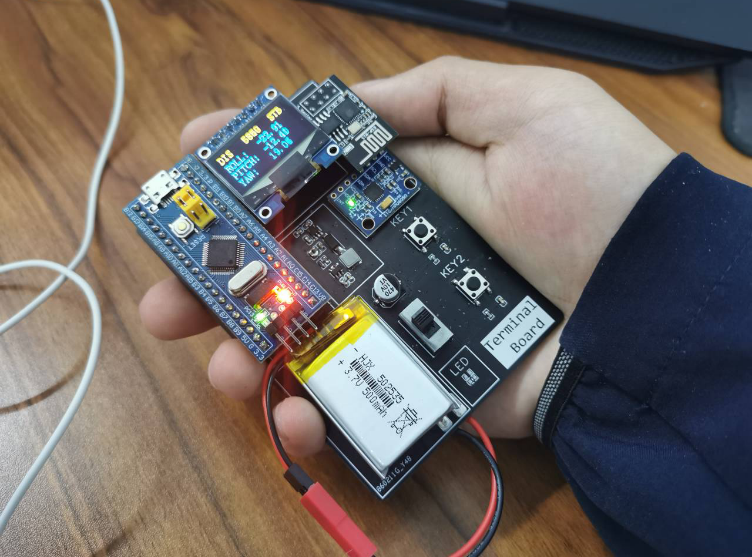

# 平衡立方体的球形版

**BalanceBall**

——by sytnocui 2023/8/31 v1.0

b站视频链接： TODO

## 0. 悲催往事

如果你打过**2021年的电赛**，你一定知道元器件清单里有一项是**亚克力球**，当时所有人都猜题目是球型机器人，一时间B站遍地都是球形机器人的视频，我们也为此屯了一堆的亚克力球，为了买球少说就花了200块钱。但可能因为疫情推迟比赛等原因，最后控制题却是一个和亚克力球毫无关系的医院物流小车。在我们破大防的同时，那一堆亚克力球怎么处理就成了问题。

>   亚克力球滞销，救救我们！！！
>

## 1. 项目说明

本项目旨在做出**球形版的平衡立方体**。在总体架构上，使用三个无刷电机带动三个正交安装的飞轮，并将整个球至于由三个**全向轮**构成的底盘上。全向轮允许前进方向和轴向的运动，则三个全向轮构成的底盘即可允许平衡球在上面做**三自由度全姿态自由机动**。球在全向轮底盘上，利用角动量守恒的原理实现球在底盘上的全姿态自由机动。

再贴张solidworks爆炸渲染图~

## 2. 开源协议

本项目使用 Apache 2.0 开源协议，转载请标明出处

## 3. 项目属性

本项目为首次公开，为本人原创项目。项目未曾在别的比赛中获奖。

另外，本项目同时也是我大四的大创项目，目前还未结题，之后会不会传给学弟去报竞赛还待商榷。

## 4. 项目相关功能及实物展示

-   平衡球全姿态自由转动

-   平衡球三轴角速度闭环控制与助力模式

-   平衡球三轴姿态跟踪随动，需搭配终端完成

-   平衡球实时发布自身三轴姿态，可模仿流浪地球方向盘，用于游玩各种赛车游戏

## 5. 设计原理

项目总体可分为结构设计，硬件设计，软件设计三部分

### 5.1 结构设计

项目的结构设计理念很大程度上参考了苏黎世的经典平衡立方体：

依照上图，平衡立方体有六个面，按照离地面的远近关系，咱们可以分成上三面和下三面。可以很明显得看到，平衡立方体的三个正交飞轮安装在下三面，而电池、电路板等均安装在上三面。

根据立体几何原理，可以很顺理成章地想到正方体是有外接球的。**取平衡立方体的外接球，将其六个面全部向外投影到其外接球上，就是咱们的平衡球**。

依据此建立的3D模型如下：

### 5.2 硬件设计

本项目设计有主控板，FOC驱动板，编码器板与陀螺仪板。项目硬件拓扑图如下：

其中：

-   主控板和FOC驱动板全部采用级联方式供电，也通过CAN总线级联传递目标指令。
-   共三个FOC驱动板，每个FOC驱动板均连接一个编码器板获取无刷电机位置，并驱动一个无刷电机。
-   主控板连接有一块陀螺仪板，实时读取姿态信息。
-   主控板连接有一块esp8266通信模块

#### 5.2.1 主控板

主控板为四层板，可嘉立创免费打印。主要完成WIFI无线通信，读取陀螺仪姿态，姿态解算，控制模式管理，控制算法运行等。

-   主控：STM32F103C8T6
-   晶振： 村田陶瓷三脚晶振CSTCE 8M （**稚晖君机械臂同款，不需要接负载电容**）

-   CAN通讯芯片：TJA1050T（**注意需5V供电，否则单片机CAN收发会卡死**）

-   电源管理：JW5026+ME6211
-   无线通信：经典插针式Esp8266无线通信模块

-   所用排座皆为GH1.25型号；

>   某宝上均可以买到，估测成本价一套下来大致30rmb左右（电子元件价格可能会有变化）。

配套编码器板可为：ICM20602，MPU6050，*ICM42688P（暂有问题，发热严重，请用icm20602模块代替）*

注意：编码器板使用热熔胶固定在球的内部最顶点，与地面平行。

#### 5.2.2 驱动板

驱动板为四层板，可嘉立创免费打印。驱动板主要完成FOC速度闭环驱动。

驱动板设计参考了柠檬FOC开源板，基于GD32进行设计。

参考地址： [【新春快乐】柠檬FOC开源板 - 嘉立创EDA开源硬件平台 (oshwhub.com)](https://oshwhub.com/a1804889557/xin-chun-kuai-le-ning-meng-FOCka) 

驱动板硬件部分自主设计，软件部分直接烧录柠檬FOC的代码使用。原开源项目可以通过putty串口助手设置电流闭环，速度和位置闭环模式，由于项目需要这里采用了速度阶跃变化模式。

使用原固件时注意在串口调试助手中修改电源欠压保护和速度保护参数，防止速度突变过快导致的电机停转。

驱动板参数如下：

-   主控：GD32C103CBT6
-   晶振： 村田陶瓷三脚晶振CSTCE 8M

-   CAN通讯芯片：SN65HVD232D

-   电源管理：JW5026+RT9013-3.3

-   电机驱动芯片：FD6288T （电机驱动芯片+mos管，大电流方案）

-   NMOS：TPH1R403NL

-   电流采样：LMV358IPWRG4 偏置低采

-   采样电阻：1206 1mR

-   所用排座皆为GH1.25型号

-   配套编码器：MT6816（**需要买支持SPI模式的**，很容易买错，不要买错了）

>   某宝上均可以买到，估测成本价一套下来大致60rmb左右（电子元件价格可能会有变化）。

#### 5.3.3 BIG手持终端

BIG手持终端是两层板，可嘉立创免费打印。BIG手持终端主要完成远程改变控制模式，安全管理，实时状态显示，发布目标位姿等功能。

该模块对标稚晖君的PICO小终端设计，主要完成一些人机交互的功能。因为面向初学者，所有看起来比较粗野。因为PICO是微小的意思，稚晖君的PICO确实很小，但我这个手持终端却很大，所以起名叫**BIG**。

手持终端参数如下：

-   主控：STM32F103C8T6蓝宝石核心板
-   显示：7脚OLED显示屏，SPI模式

-   电池：1s锂电池 300mah 

-   陀螺仪：经典MPU6050模块

-   无线通信：经典插针式Esp8266无线通信模块

### 5.3 软件设计

#### 5.3.1 全姿态阻力效果

在主控板上进行，利用Mahony姿态解算方法，解出实时roll pitch yaw三轴角度，并分别建立PID反馈控制。每当有某个轴上有角速度，通过PID算法在该轴上产生相反方向的控制输出。最终将三轴的PID控制输出叠加后，左乘转速分配矩阵，将其解算成三个正交安装的飞轮的转速，输出给FOC驱动板，即可在球的三自由度全姿态运动中产生阻力效果。

#### 5.3.2 三轴姿态跟踪随动

在5.3.1节的基础上，添加姿态角反馈，由BIG手持终端收集自身姿态，作为平衡球姿态的目标值，与平衡球姿态的实际值做差，构成PID控制器。最终实现三轴姿态跟踪随动。

因为全向轮底盘会给系统引入非常大的摩擦力，所以目前这个功能需要将球直接放在地面上，而不能放在全向轮底盘上进行。

考虑到纯PID效果有限，本项目之后会使用LQR等控制算法部署上做进一步对比测试。

#### 5.3.3 作为方向盘游玩赛车游戏

我们偶然发现，我们的球和流浪地球的球形方向盘非常类似，于是，使用wifi模块连接电脑，接收球形仿真器实时姿态信息，并将其使用python的vgamepad库，映射成虚拟的xbox游戏手柄的摇杆值（方向盘，油门，刹车等）。这样就可以在尘埃拉力赛2.0等赛车游戏中识别虚拟游戏摇杆，进而获得控制数据了。

因为是将控制数据封装成xbox手柄的形式，所以不管游玩任何赛车游戏，都不会有兼容性的问题。

## 6. 注意事项

### 6.1 软件说明

本项目提供主控板与BIG手持终端的固件代码，驱动板的固件与柠檬FOC完全一致，烧录与使用也请完全参考柠檬FOC的工程：

参考链接： [【新春快乐】柠檬FOC开源板 - 嘉立创EDA开源硬件平台 (oshwhub.com)](https://oshwhub.com/a1804889557/xin-chun-kuai-le-ning-meng-FOCka) 

本项目所有单片机固件均使用Clion开发，如果你对Clion工程配置比较生疏，建议观看稚晖君的Clion+Stm32环境配置指南：

参考链接： [配置CLion用于STM32开发【优雅の嵌入式开发】 - 知乎 (zhihu.com)](https://zhuanlan.zhihu.com/p/145801160) 

### 6.2 电机选型

飞轮与无刷电机的选型是十分重要的，由于整个系统摩擦力很大，开源社区常见的莱洛三角形和平衡方块使用的低kv云台电机很难满足力矩需求。我在淘宝二手电机无意中发现了这款电机：

经过测试，该电机负载能力用到本项目非常合适，成本低廉（仅16元），且比较节省空间。考虑到这种二手电机经常卖完就没了，如果之后该电机售罄，可以考虑使用 *大疆2312精灵电机* 替代。

另外，若铝合金飞轮可以提供的反作用力矩不足，可模仿这个开源工程的方案，自制飞轮并在外边缘钻孔安装螺栓来增加飞轮转动惯量。

参考地址：[基于LQR控制器的自平衡莱洛三角形_哔哩哔哩_bilibili](https://www.bilibili.com/video/BV19v411n7mN/?vd_source=4ff5d8b280178b24895437b1b8ffd97e) 

### 6.3 陀螺仪选型

本项目涉及的陀螺仪板使用的是icm42688p，但是从某宝买的不同批次的icm42688p均出现虽然能读出正确的数据，但有发热严重（约60度），带来的温漂严重等问题。确认不是焊接问题，暂时不知道是不是物料问题或者硬件设计有问题。建议谨慎考虑从淘宝购买icm42688p。本项目暂时使用逐飞科技的icm20602模块充当陀螺仪板。

本项目目前使用的是从社团嫖的icm20602模块，同时球主控板也支持mpu6050接插件。三款陀螺仪的驱动代码均在工程中，但接口代码需自行更改。

## 8. 项目进度

**2023/8/30首次开源**

项目已完成的部分：

-   项目已完成所有结构+硬件设计与搭建，结构与硬件设计已经收敛成熟。
-   项目已完成所有逻辑代码编写。
-   项目已完成基础的控制算法的编写，可以完成基础的角速度闭环与姿态闭环控制。

项目的后续计划：

-   由于控制系统的复杂性，项目后续需要对姿态闭环控制代码做优化，主要措施包括：
    -   增加配重，使重心趋于球形正中心，且使三轴惯量趋于一致。
    -   PID是真不行，换成基于模型的控制算法，如基于欧拉方程基于LQR建模
    -   对摩擦力进行参数辨识，使用干扰观测器补偿之（也可使用ADRC算法）
    -   尝试基于四元数的姿态闭环控制，以消除欧拉角死锁问题。
-   项目成员正在自主研发基于stm32f103c8t6的FOC驱动代码。研发完成后将会替换掉目前使用的柠檬FOC大佬的基于gd32的驱动板。
-   将会基于Qt与OpenGL写一个能实时可视化姿态与远程调参的上位机软件，效果可参考稚晖君的电子机器人和各种飞控调试助手。
-   将会实现一套嵌入式shell，以支持通过wifi串口进行远程调参
-   为陀螺仪添加减震垫，防止电机的高频振动给陀螺仪引入干扰
-   找出icm42688p的问题，换掉现在正在用的icm20602

## 9. 物资说明

结构件物料清单：

| 物资                          | 用途                 | 需求个数 | 购买链接                                 |
| :---------------------------- | -------------------- | :------: | ---------------------------------------- |
| **球主体结构**                |                      |          |                                          |
| 亚克力球壳 20mm               | 球透明外壳           |   >=2    | https://m.tb.cn/h.54hODsa?tk=Q7ZXdzW9Ydo |
| 3D打印（内部支撑架-连点）     | 十字形主体框架       |    6     | 嘉立创三维猴                             |
| 3D打印（内部支撑架-桥接点）   | 主体框架的连接点     |    8     | 嘉立创三维猴                             |
| 3D打印（支架-电池小）         | 固定电池             |    1     | 嘉立创三维猴                             |
| **无刷电机相关**              |                      |          |                                          |
| 盘式无刷电机ZD2808-V1.9       |                      |    3     | https://m.tb.cn/h.5WJTsy4?tk=4qczdC51605 |
| 铝合金飞轮6mm 80mm            |                      |    3     | https://m.tb.cn/h.5e1xS1N?tk=HlGCdC6gCA1 |
| 径向磁铁6*2.5                 | 获取电机轴位置       |    3     | https://m.tb.cn/h.54hiYKJ?tk=QM5mdzWTh2m |
| 3M超能胶                      | 将磁体固定在电机轴上 |    1     | https://m.tb.cn/h.54AlcCb?tk=jlEVdzWQEFG |
| **球主体配件**                |                      |          |                                          |
| M3*8杯头螺丝                  | 主要结构固定螺丝     |   若干   |                                          |
| M3防松螺母                    | 主要结构固定螺母     |   若干   |                                          |
| 铜柱 M3*10+6                  | 主要支撑铜柱         |    20    |                                          |
| M3*5\*5嵌入式螺母             | 连接球壳与3D打印件   |    2     |                                          |
| M3*8沉头螺丝                  | 连接球壳与3D打印件   |    2     |                                          |
| 配重                          | 平衡重心位置         |   若干   | https://m.tb.cn/h.56VXPSI?tk=n4DUWYhMTac |
| **电路部分**                  |                      |          |                                          |
| 主控板                        |                      |    1     | 嘉立创免费打板，元件自行处理             |
| FOC驱动板                     |                      |    3     | 嘉立创免费打板，元件自行处理             |
| 编码器板                      |                      |    3     | 嘉立创免费打板，元件自行处理             |
| 陀螺仪板（可选）              |                      |    1     | 嘉立创免费打板，元件自行处理             |
| BIG手持终端                   |                      |    1     | 嘉立创免费打板，元件自行处理             |
| wifi模块                      | 球与BIG，球与PC通信  |    3     | https://m.tb.cn/h.56vZKps?tk=XmldWYhGjPn |
| wifi模块连接电脑的usb转串模块 | 球与PC通信           |    1     | https://m.tb.cn/h.56vZKps?tk=XmldWYhGjPn |
| 航模电池3s 550mah 85c         | 供电                 |   >=1    | https://m.tb.cn/h.5fuIsF0?tk=Pxn2dzWQvsg |
| **线材**                      |                      |          |                                          |
| 硅胶线18awg                   | 电源线               |   若干   |                                          |
| 硅胶线20awg                   | 电机线               |   若干   |                                          |
| GH1.25 6p 双头反向 30cm       | 编码器线             |    3     |                                          |
| GH1.25 6p 双头反向 30cm       | 陀螺仪线             |    1     |                                          |
| GH1.25 2p 双头反向 15cm       | CAN总线              |    4     |                                          |
| xt30头                        | 连接电池             |    1     |                                          |
| **底盘**                      |                      |          |                                          |
| 亚克力切割（底盘-上层）       | 底盘主体             |    1     | 淘宝找亚克力切割                         |
| 3D打印（全向轮轴座-键）       | 支撑全向轮           |    3     | 嘉立创三维猴                             |
| 3D打印（全向轮轴座-圆）       | 支撑全向轮           |    3     | 嘉立创三维猴                             |
| 3D打印（万向轮支撑腿-分体式） | 支撑全向轮           |    6     | 嘉立创三维猴                             |
| F车模全向轮                   | 支撑亚克力球壳       |    3     | https://m.tb.cn/h.5Vqiebu?tk=y4CAdzW76o4 |
| 轴承7\*11\*3                  | 连接全向轮和光轴     |    6     | https://m.tb.cn/h.54hQEqA?tk=cFWBdzW7L1a |
| 光轴切割（全向轮光轴）        | 支撑全向轮，注意开槽 |    3     | https://m.tb.cn/h.5fuKVfU?tk=G4sGdzW7mtl |
| M4*55螺丝                     | 固定全向轮轴座       |    12    |                                          |
| M4防松螺母                    | 固定全向轮轴座       |    12    |                                          |
| 脚垫（可选）                  | 底座防滑             |   若干   | https://m.tb.cn/h.54AknHL?tk=cSfIdzWjeUe |

整套下来价格800~1000元左右，某些零部件价格变化较大，请以实际情况为准。
